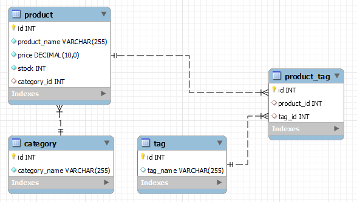
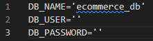
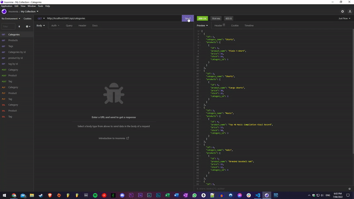

# E-commerce-backend


## Description
A simple e-commerce backend for a fictional store. It is a REST API that allows you to create, read, update, and delete products, categories, and tags. The model is based on mySQL and sequelize. The backend is written in Node.js and uses the Express framework. A walk-through of the application can be found [here](https://www.youtube.com/watch?v=ofM3NeMHMQE).


Below is the application schema:


## Table of Contents
1. [Installation](#installation)
2. [Usage](#usage)
3. [License](#license)
4. [Contributing](#contributing)
5. [Tests](#tests)
6. [Questions](#questions)

## Installation
- To install the application please follow the instructions below.
```bash
- git clone git@github.com:daman29/e-commerce-backend.git
- npm i
```
- Then create update .env.EXAMPLE to .env and update the database connection information below.

- Then in MySQL source the schema file.
```bash
- source schema.sql;
```
- Then in the terminal run the following command to seed the database.:
```bash
- npm run seed
```

## Usage
- Run the application with the following command:
```bash
- npm start
```
- Visit the application repository at [GitHub Repository](https://github.com/daman29/e-commerce-backend)

- [Click on this link](https://www.youtube.com/watch?v=ofM3NeMHMQE) to view the video demo of the application.

The GIF below shows the application's appearance and functionality.




## License
- This application is licensed under the [MIT License](./LICENSE)

## Contributing
- Clone repository first using git clone
- Contribute your changes to a new branch

## Tests
- No test commands

## Questions
- Reach me via email at damneet.sambhy@hotmail.com or issues on [github](https://github.com/daman29)